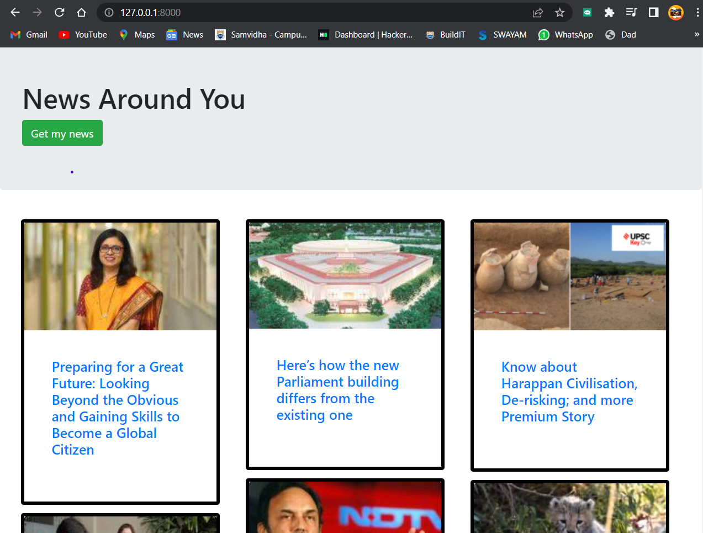

# NewsApp Django Project

This repository contains a Django project called NewsApp, which is a web application that collects news articles by web scraping from a popular news site and integrates them into a Django website. This README.md file provides an overview of the project, including the technologies used, project description, and images of the website.

## Technologies Used

The NewsApp Django project utilizes the following technologies:

- Python
- Django
- HTML
- CSS
- JavaScript
- Beautiful Soup (for web scraping)
- SQLite (default database for Django)

## Project Description

NewsApp is a Django web application that allows users to browse and read news articles collected from a popular news site. The project uses web scraping techniques to extract the latest news articles and stores them in a database. The collected news articles are then presented to the users through a user-friendly website interface.

Key features of the NewsApp project:

- Scrapes news articles from a popular news site
- Stores the collected articles in a database
- Displays the articles on a website
- Allows users to browse and read the articles
- Provides search functionality to search for specific news articles
- Offers a responsive and intuitive user interface

## Screenshots

Here are some screenshots of the NewsApp website:

The above image shows the home page of the NewsApp website, where users can find a list of the latest news articles.

The above image shows the article page of the NewsApp website, where users can read a specific news article in detail.

## Getting Started

To run the NewsApp Django project locally, follow these steps:

1. Clone the repository: `git clone https://github.com/praneetha28-ai/NewsApp.git`
2. Navigate to the project directory: `cd newsapp`
3. Create a virtual environment (optional but recommended): `python -m venv venv`
4. Activate the virtual environment: 
   - On Windows: `venv\Scripts\activate`
   - On macOS/Linux: `source venv/bin/activate`
5. Install the project dependencies: `pip install -r requirements.txt`
6. Run the database migrations: `python manage.py migrate`
7. Start the development server: `python manage.py runserver`
8. Open your web browser and access the website at `http://localhost:8000`

## License

This project is licensed under the [MIT License](LICENSE).

Feel free to contribute, report issues, or provide feedback.